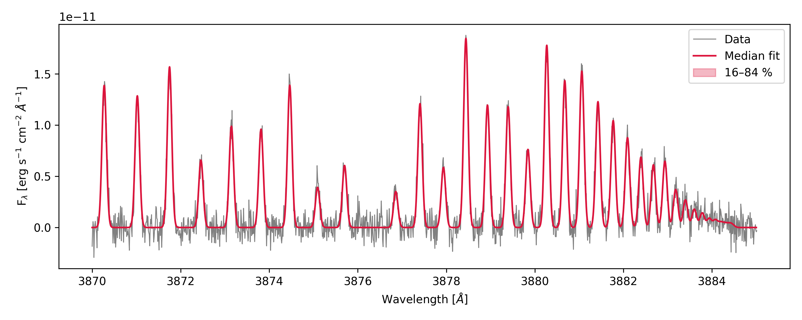
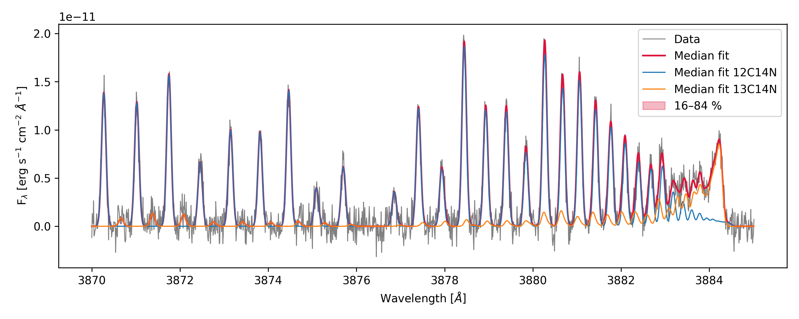
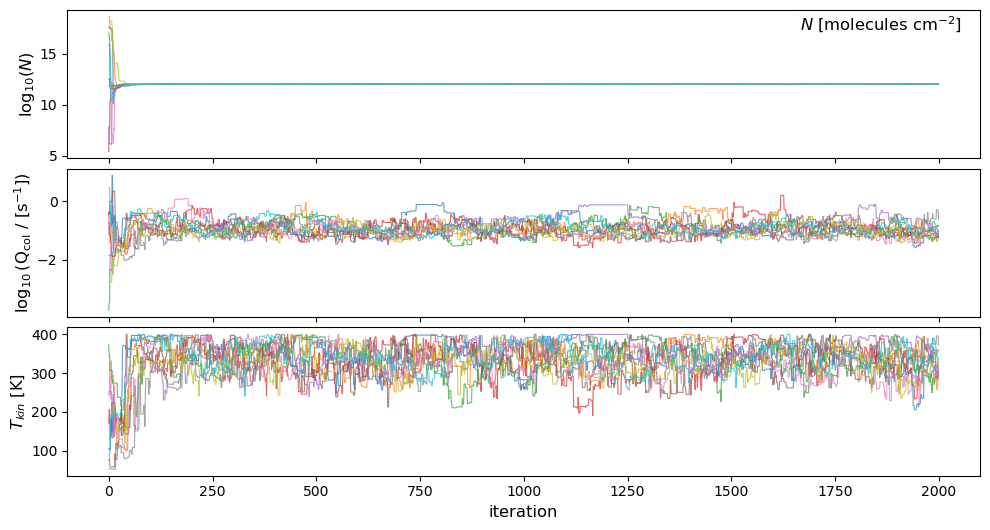
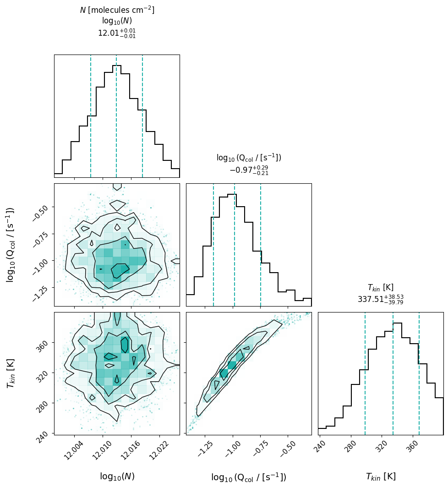
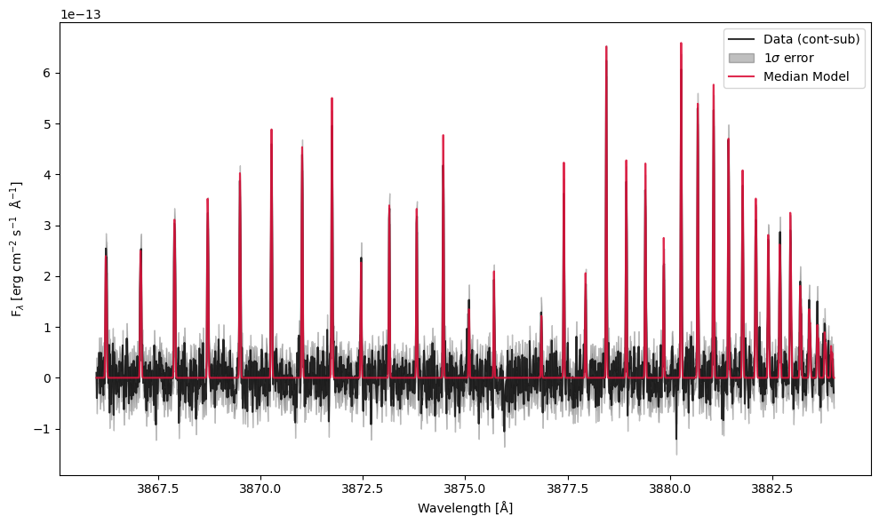

MCMC Fitting
============

:meth:`~cometspec.fluorescence.FluorescenceModel.fit_mcmc` runs an
`emcee <https://emcee.readthedocs.io>`_ ensemble sampler on a
:class:`~cometspec.fluorescence.FluorescenceModel`. Priors are **uniform**; the ``priors``
dictionary controls both *which* parameters are free and their allowed ranges.
Parameters absent from ``priors`` are **fixed** at their current values.

All examples use synthetic spectra generated from a known model with Gaussian
noise added — no observational data is required.

We recommend checking the :meth:`~cometspec.fluorescence.FluorescenceModel.fit_mcmc` method for the full list of available
parameters and options.

.. rubric:: Sections

- :ref:`gs-mc-single`
- :ref:`gs-mc-multi`
- :ref:`gs-mc-fixed`
- :ref:`gs-mc-plots`
- :ref:`gs-mc-results`
- :ref:`gs-mc-parallel`
- :ref:`gs-mc-config`
- :ref:`gs-mc-sl`

----

.. _gs-mc-single:

Single-isotopologue fit
-----------------------

Pass the observed DataFrame and wavelength window when constructing the
model, then call :meth:`~cometspec.fluorescence.FluorescenceModel.fit_mcmc` with the desired prior ranges. When creating the
Fluorescence model you have the option to specify the columns in your DataFrame that
contain the wavelength, flux, error, and continuum data; you can change them using the
``wave_col``, ``flux_col``, ``error_col``, and ``continuum_col`` parameters.

.. note::

   The collisional parameter ``f_col`` (and per-iso variants
   ``f_col_<iso>``) is defined as
   :math:`f_{\rm col} \equiv \log_{10}(C_{ul}\,/\,\mathrm{s}^{-1})`, where the
   same downward rate :math:`C_{ul}` is assumed for every upper-to-lower pair
   included in the collision scaffold.

.. code-block:: python

    from cometspec.helper import open_kurucz_irradiance, open_hall_anderson_irradiance
    from cometspec import FluorescenceModel
    from matplotlib import pyplot as plt
    import numpy as np
    import pandas as pd

    irradiance = open_kurucz_irradiance()

    model = FluorescenceModel(
        window=(3870, 3885),
        pumping=irradiance,
        isotopologues="12C14N",
        systems=['BX', 'AX_dv1'],
        sigma=0.05,
        f_col=-1,
        logN=14.0,
        T=200,
        v_kms=0,
        lsf_method="Gauss",
        wave_col="WAVE",
        flux_col="FLUX",
        error_col="ERR",
        continuum_col="CONTINUUM",
    )

    # add noise
    data_flux = model.best_model + np.random.normal(0, np.max(model.best_model)*0.05, 
                                                        size=model.model_wave.shape)
    data = pd.DataFrame({'WAVE': model.model_wave, 
                        'FLUX': data_flux, 
                        'ERR':np.max(model.best_model)*0.05, 
                        'CONTINUUM': np.zeros_like(model.model_wave)})

    results = model.fit_mcmc(
                    data=data,
                    nwalkers=10,
                    nsteps=500,
                    priors={
                        "logN":  (12.0, 16.0),
                        "T":     (50.0, 300.0),
                        "v_kms": (-2.0, 2.0),
                    },
                        make_plots=False,
                    )
    
    print("Median logN :", model.median_params["logN"])
    print("Median T    :", model.median_params["T"])

    plt.figure(figsize=(10, 4))
    plt.plot(data["WAVE"], data["FLUX"], 
            color="gray", lw=0.8, label="Data")
    plt.plot(model.model_wave, model.median_model,
            color="crimson", lw=1.5, label="Median fit")
    plt.fill_between(
        model.model_wave,
        model.model_p16, model.model_p84,
        alpha=0.3, color="crimson", label="16–84 %",
    )
    plt.xlabel(r"Wavelength [$\AA$]")
    plt.ylabel(r"F$_\lambda$ [erg s$^{-1}$ cm$^{-2}$ $\AA^{-1}$]")
    plt.legend()
    plt.tight_layout()
    plt.show()

The main attributes of :class:`~cometspec.fluorescence.FluorescenceModel` available after fitting are the updated model parameters and the following:

- ``param_keys`` (names of the fitted parameters)
- ``median_params`` (median values of the fitted parameters)
- ``up_errors_params`` (upper errors of the fitted parameters, from the 84th percentile to the median)
- ``low_errors_params`` (lower errors of the fitted parameters, from the median to the 16th percentile)
- ``samples_pruned`` (the MCMC sample chain after burn-in and pruning, if applicable)
- ``lnprob_pruned`` (log-probability values corresponding to the pruned sample chain)
- ``median_model`` (median model spectrum)
- ``best_model`` (best-fit model spectrum, same as the median model)
- ``model_wave`` (updated model wavelength grid)
- ``model_p16`` (16th percentile model spectrum)
- ``model_p84`` (84th percentile model spectrum)
- ``model_by_iso`` (model spectra split by isotopologue, if multiple isotopologues are present)

----

.. _gs-mc-multi:

Multi-isotopologue fit
----------------------

Use isotopologue-specific prior keys — ``logN_13C14N``, ``T_13C14N``, etc. —
to give each species its own parameter range. Any iso-specific key not found
falls back to the shared key (``logN_by_iso``, ``T_by_iso``, …), and if that is also not found, it falls back to the default value
(``logN``, ``T``, …). We highly encourage setting all isotopologues in the ``by_iso`` parameters (if used) when building the model, in order to
avoid confusion.

.. code-block:: python

    model2 = FluorescenceModel(
        window=(3870, 3885),
        pumping=irradiance,
        isotopologues=["12C14N", "13C14N"],
        systems=['BX', 'AX_dv1'],
        sigma=0.05,
        f_col_by_iso={"12C14N": -1, "13C14N": -2},
        logN_by_iso={"12C14N": 14.0, "13C14N": 13.5},
        T=200,
        v_kms=0,
        lsf_method="Gauss",
        wave_col="WAVE",
        flux_col="FLUX",
        error_col="ERR",
        continuum_col="CONTINUUM",
    )

    # add noise
    data_flux = model2.best_model + np.random.normal(0, np.max(model2.best_model)*0.05,
                                                        size=model2.model_wave.shape)
    data = pd.DataFrame({'WAVE': model2.model_wave,
                        'FLUX': data_flux,
                        'ERR':np.max(model2.best_model)*0.05,
                        'CONTINUUM': np.zeros_like(model2.model_wave)})

    results2 = model2.fit_mcmc(
        data=data,
    nwalkers=20,
    nsteps=100,
    priors={
        "logN_12C14N": (12.0, 16.0),
        "logN_13C14N": (11.0, 15.0),
        "T":           (50.0, 300.0),
    },
    make_plots=False,
    n_cores=2
    )

  
    plt.figure(figsize=(10, 4))
    plt.plot(data["WAVE"], data["FLUX"],
            color="gray", lw=0.8, label="Data")
    plt.plot(model2.model_wave, model2.median_model,
            color="crimson", lw=1.5, label="Median fit")
    for iso in model2.isotopologues:
        plt.plot(model2.model_by_iso[iso][0], model2.model_by_iso[iso][1],
                lw=1.0, label=f"Median fit {iso}")
    plt.fill_between(
        model2.model_wave,
        model2.model_p16, model2.model_p84,
        alpha=0.3, color="crimson", label="16–84 %",
    )
    plt.xlabel(r"Wavelength [$\AA$]")
    plt.ylabel(r"F$_\lambda$ [erg s$^{-1}$ cm$^{-2}$ $\AA^{-1}$]")
    plt.legend()
    plt.tight_layout()
    plt.show()

In this example ``T`` is shared between both isotopologues, while ``logN`` has separate priors and fitted values.
``f_col_by_iso`` is not present in the priors, so it is fixed at the values given in the model constructor.

----

.. _gs-mc-fixed:

LSF fitting
---------------------------------

You can also include in the priors any of the LSF parameters (``sigma``, ``sigma1``, ``sigma2``, ``sigma_G``, ``fwhm_L``, ``ratio``) to fit the line spread function together
with the physical parameters (while being consistent with the ``lsf_method``).

.. code-block:: python

    print('Original sigma:', model.sigma)

    model.fit_mcmc(
        nwalkers=10, nsteps=100,
        priors={'logN': (12.0, 16.0), 'sigma': (0.01, 0.1)},
        make_plots=False,
    )

    print('Fitted sigma:', model.median_params.get('sigma'))
    print('Fitted sigma:', model.sigma)

The full list of fittable parameters is: ``logN``, ``f_col``, ``T``,
``v_kms``, ``dlam``, their per-isotopologue variants
(e.g. ``logN_13C14N``), and LSF parameters ``sigma``, ``sigma1``,
``sigma2``, ``sigma_G``, ``fwhm_L``, ``ratio`` depending on the chosen
``lsf_method``. Additionally, if you provide the LSF via a custom callable,
it will be used for the fit, so you can ignore the LSF priors.

.. code-block:: python

    def lsf(x):
        """Example of a custom LSF function: a simple Gaussian."""
        import numpy as np  # imported inside so multiprocessing workers have access
        sigma = 0.02  # Standard deviation of the Gaussian
        return (1 / (sigma * np.sqrt(2 * np.pi))) * np.exp(-0.5 * ((x) / sigma) ** 2)

    model = FluorescenceModel(pumping=irradiance,
                            isotopologues=['12C14N'],
                            systems=['B-X'],
                            lsf=lsf,
                            A_min=1e3,
                            logN = 14,
                            f_col= -1,
                            T=300.0,
                            window=(3865.0, 3885.0),
                            wave_col="WAVE",
                            flux_col="FLUX",
                            error_col="ERR",
                            continuum_col="CONTINUUM",
                            a=7)
    # add noise
    data_flux = model.best_model + np.random.normal(0, np.max(model.best_model)*0.05, 
                                                    size=model.model_wave.shape)
    data = pd.DataFrame({'WAVE': model.model_wave, 'FLUX': data_flux, 
                        'ERR':np.max(model.best_model)*0.05, 
                        'CONTINUUM': np.zeros_like(model.model_wave)}) 

    model.fit_mcmc(
        data=data,
        nwalkers=20, nsteps=300,
        priors={'logN': (12.0, 16.0)},
        make_plots=False,
        lsf=model.lsf # This needs to be set if it is a custom LSF
    )

----

.. _gs-mc-plots:

Plotting results
----------------

:meth:`~cometspec.fluorescence.FluorescenceModel.fit_mcmc` saves and shows diagnostic figures when ``make_plots=True`` (the
default). With ``fig_file`` you can specify a custom path prefix for the corner and fit plots.

.. code-block:: python

    priors = {
        'logN': (5, 20),
        'f_col': (-4, 1),
        'T': (10, 400),
    }

    model = FluorescenceModel(
        window = (3866.0, 3884.0),
        pumping=irradiance,
        lsf_method="Gauss",
        A_min=1e4,
        name=f'CN_Model',
        sigma = 0.01,
        logN=12.0,
        v_kms=0.0,
        T=300.0,
        f_col=-1.0,
        isotopologues=['12C14N'],
        wave_col="WAVE",
        flux_col="FLUX",
        error_col="ERR",
        continuum_col="CONTINUUM",
    )

    # add noise
    data_flux = model.best_model + np.random.normal(0, np.max(model.best_model)*0.05,
                                                    size=model.model_wave.shape)
    data = pd.DataFrame({'WAVE': model.model_wave, 'FLUX': data_flux,
                        'ERR':np.max(model.best_model)*0.05,
                        'CONTINUUM': np.zeros_like(model.model_wave)})

    model.fit_mcmc(data = data,
            nwalkers=10,
            nsteps=2000,
            priors=priors,
            make_plots=True,
            progress=True,
            A_min=1e5,
            a=3,
            fig_file='example',
            )

This code will produce a **traces** plot where you can see the trace of each walker
throughout the MCMC steps for each fitted parameter, a **corner** plot showing the posterior
distributions and covariances of the fitted parameters, and a **fit** plot showing the
observed spectrum with its error and the median model fit. All three are saved as ``pdf`` files.

If you want to recreate the fit, you can use any of the attributes above to access the model.
The traces cannot be regenerated, as all the walkers were collapsed and pruned.
If you want to recreate the corner plot, you can do so using ``samples_pruned``.
Here is an example using the corner package:

.. code-block:: python

    param_labels = model.param_keys
    import corner
    fig = corner.corner(
                model.samples_pruned,
                labels=param_labels,
                title_kwargs={'fontsize': 12, 'y': 1.05},
                title_fmt=".2f",
                use_math_text=True,
                bins=15,
                quantiles=[0.16, 0.5, 0.84],
                show_titles=True,
                color='crimson',
                hist_kwargs={'color': 'black', 'linewidth': 1.5},
                contour_kwargs={'linewidths': 1, 'colors': 'black'},
                label_kwargs={'fontsize': 11},
                fig=plt.figure(figsize=(8, 8)), 
            )
    axes = np.array(fig.axes).reshape((len(param_labels), len(param_labels)))

    for i in range(len(param_labels)):
        ax = axes[i, i]
        q16, q50, q84 = np.quantile(model.samples_pruned[:, i], [0.16, 0.5, 0.84])
        q_minus, q_plus = q50 - q16, q84 - q50
        title = (
            f"{param_labels[i]}\n"
            rf"=${q50:.2f}_{{-{q_minus:.2f}}}^{{+{q_plus:.2f}}}$"
        )
        ax.set_title(title, fontsize=12, y=1.05)
    plt.show()

And then you can edit it as you prefer.

----

.. _gs-mc-results:

Extracting results
------------------

All posterior summaries are stored as instance attributes of :class:`~cometspec.fluorescence.FluorescenceModel` after the fit. As mentioned before:

- ``param_keys`` (names of the fitted parameters)
- ``median_params`` (median values of the fitted parameters)
- ``up_errors_params`` (upper errors of the fitted parameters, from the 84th percentile to the median)
- ``low_errors_params`` (lower errors of the fitted parameters, from the median to the 16th percentile)
- ``samples_pruned`` (the MCMC sample chain after burn-in and pruning, if applicable)
- ``lnprob_pruned`` (log-probability values corresponding to the pruned sample chain)
- ``median_model`` (median model spectrum)
- ``best_model`` (best-fit model spectrum, same as the median model)
- ``model_wave`` (updated model wavelength grid)
- ``model_p16`` (16th percentile model spectrum)
- ``model_p84`` (84th percentile model spectrum)
- ``model_by_iso`` (model spectra split by isotopologue, if multiple isotopologues are present)

.. code-block:: python

   print("Fitted parameters:", model.param_keys)
   print("Medians          :", model.median_params)
   print("Upper errors (1σ):", model.up_errors_params)
   print("Lower errors (1σ):", model.low_errors_params)

   # Formatted column density with asymmetric errors
   logN_med = model.median_params["logN"]
   logN_up  = model.up_errors_params["logN"]
   logN_lo  = model.low_errors_params["logN"]
   print(f"log N = {logN_med:.2f} +{logN_up:.2f} / -{logN_lo:.2f}  [cm^-2]")

   # Full pruned sample chain (shape: n_samples × n_params)
   print("Sample chain shape:", model.samples_pruned.shape)

----

.. _gs-mc-parallel:

Parallel MCMC
-------------

The walker likelihood evaluations are independent within each emcee step,
so they can be parallelized across CPU cores. CometSpec uses the
``multiprocess`` package. It is installed automatically as a CometSpec dependency.
Pass ``n_cores>1`` either when constructing the
model (stored as ``self.n_cores``) or directly to :meth:`~cometspec.fluorescence.FluorescenceModel.fit_mcmc`.

.. code-block:: python

   results_par = model.fit_mcmc(
       nwalkers=20,
       nsteps=500,
       n_cores=8,                # parallelize walkers across 8 cores
       priors={
           "logN":  (12.0, 16.0),
           "T":     (50.0, 300.0),
           "v_kms": (-2.0, 2.0),
       },
       make_plots=False,
   )

.. important::
   **Running from a ``.py`` script:** when ``n_cores > 1``, the call to
   :meth:`~cometspec.fluorescence.FluorescenceModel.fit_mcmc` (or
   :func:`cometspec.mcmc.mcmc_fitting`) must be guarded by
   ``if __name__ == "__main__":``. Each ``spawn`` worker re-imports
   the user script, and without the guard the parallel call would
   re-execute on import and Python aborts with a clear ``RuntimeError``.

   .. code-block:: python

      # my_script.py
      import cometspec

      def run_fit():
          model = cometspec.FluorescenceModel(...)
          return model.fit_mcmc(n_cores=8, ...)

      if __name__ == "__main__":
          results = run_fit()

   Imports, function definitions, and helper code stay at module level —
   only the actual ``fit_mcmc`` invocation needs to be inside the guard.
   The guard is **not** needed in Jupyter notebooks, nor when
   ``n_cores`` is ``None`` or ``1``.

.. note::
   When using ``n_cores > 1``, any module a custom ``lsf`` relies on
   (``numpy``, ``scipy``, …) must be imported **inside** the function
   so the worker processes can recognize it. Example:

   .. code-block:: python

      def lsf(x):
          import numpy as np
          sigma = 0.02
          return (1 / (sigma * np.sqrt(2 * np.pi))) * np.exp(-0.5 * (x / sigma) ** 2)

----

.. _gs-mc-config:

Using config files
------------------

:class:`~cometspec.config.MCMCFitConfig` groups all MCMC options into a single
dataclass, mirroring :class:`~cometspec.config.FluorescenceModelConfig` for model
setup. Again, the default is that any parameter present in the config file
will overwrite any kwarg passed to the function.

.. code-block:: python

    from cometspec import MCMCFitConfig

    mcmc_cfg = MCMCFitConfig(
        nwalkers=10,
        nsteps=100,
        n_cores=2,
        make_plots=False,
        priors={
            "logN":  (12.0, 16.0),
            "T":     (50.0, 300.0),
            "v_kms": (-2.0, 2.0),
        },
    )

    results_cfg = model.fit_mcmc(config=mcmc_cfg)

----

.. _gs-mc-sl:

Save and Load MCMC results
--------------------------

In order to save and then access your MCMC results
in the future, you can use the methods :meth:`~cometspec.fluorescence.FluorescenceModel.save` and :meth:`~cometspec.fluorescence.FluorescenceModel.load` respectively,
which save and load a pickle of the model.

.. code-block:: python

    model.save(filename=f'result.pkl')

    model = FluorescenceModel.load(filename=f'result.pkl')

